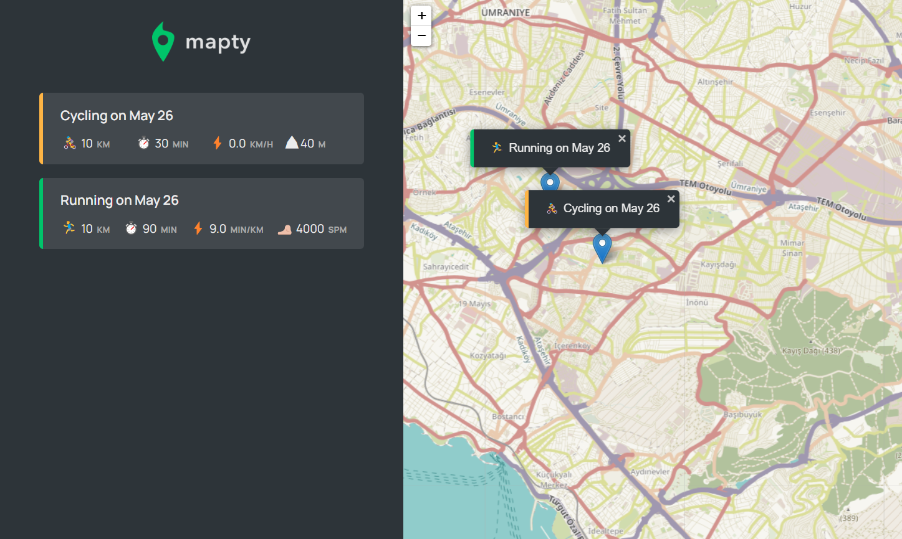

# 🗺️Mapty App Project

Logic of the app:
Mapty app saves and shows your workouts that logs activities based on cycling or running with their locations on map.
First, the location of workout is clicked on map, after required values are entered(Type, duration, distance, cadence), and is saved and displayed on the sidebar.

Based on running, it displays🏃‍♀️:
-Activity distance
-Activity duration
-Running pace
-SPM value(Step per minute)

Based on cycling, it displays🚴:
-Activity distance
-Activity duration
-Speed
-Total feet climbed

# Built with

Project is built with HTML, CSS, JavaScript.
Leaflet is used as 3rd party library for displaying the map.
Geolocation API is used to reach locations.

# Reach MaptyApp

You can reach the project here, [MaptyApp](http://127.0.0.1:5500/mapty_app/index.html)

# Visual of the project

# Acknowledgments

Project is built during the course in Udemy.
The Complete JavaScript Course 2023: From Zero to Expert! by Jonas Schmedtmann.
